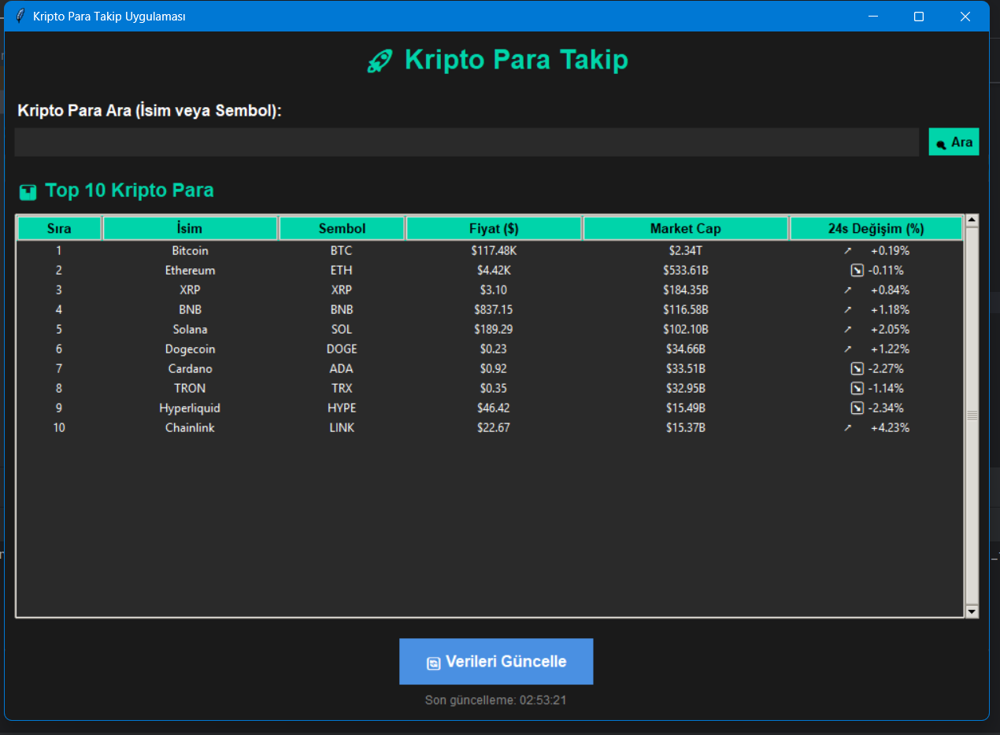

# 🚀 Kripto Para Takip Uygulaması

 

  Python ve Tkinter kullanılarak geliştirilmiş bu masaüstü uygulama, kullanıcıların **kripto para piyasasını gerçek zamanlı olarak takip etmesini** sağlar.
CoinGecko API üzerinden veri çekerek en popüler 10 kripto parayı listeler ve arama ile detaylı bilgilerini sunar.

---
 

## 🔹 Özellikler

- 🌐 **Top 10 Kripto Para Takibi:** Stablecoin’ler ve wrapped token’lar filtrelenerek en popüler 10 kripto para listelenir.
- 🔍 **Kripto Para Arama:** İsim veya sembol ile kripto para araması yapılabilir.
- 📊 **Detaylı Bilgi:** Fiyat, market cap, 24s/7g değişim, 24s en yüksek/düşük, dolaşımdaki arz gibi bilgiler.
- 🔄 **Veri Güncelleme:** Tek tık ile güncel veriler alınabilir.
- 🎨 **Modern UI:** Karanlık tema, renkli değişim göstergeleri ve temiz arayüz.
- 🧵 **Thread Kullanımı:** Arka planda veri çekme ile uygulama donmaz.

